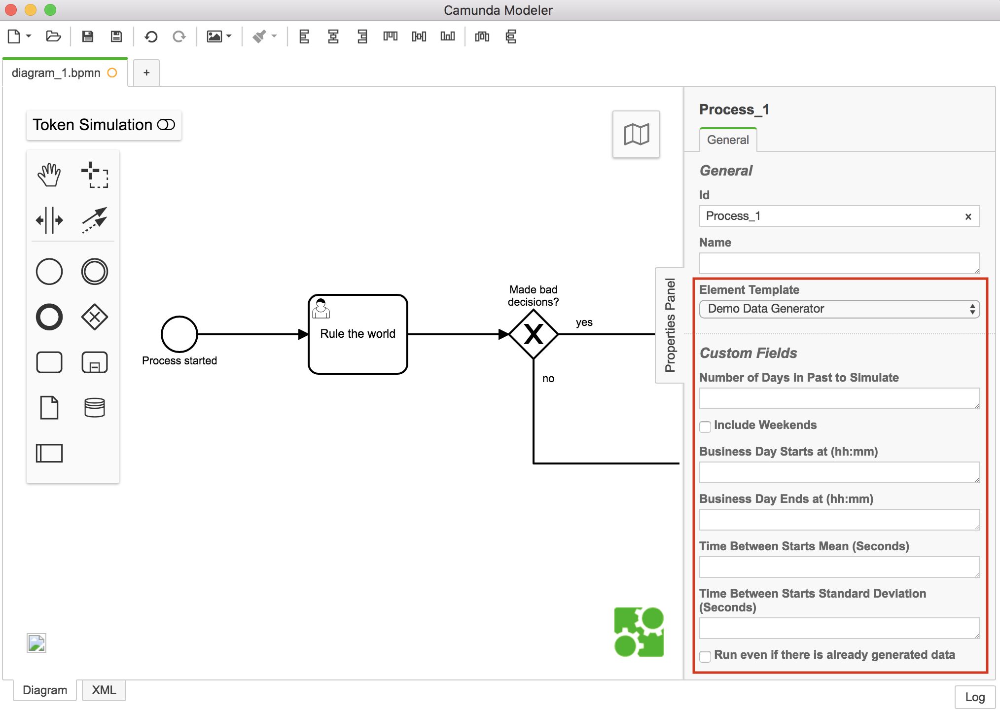
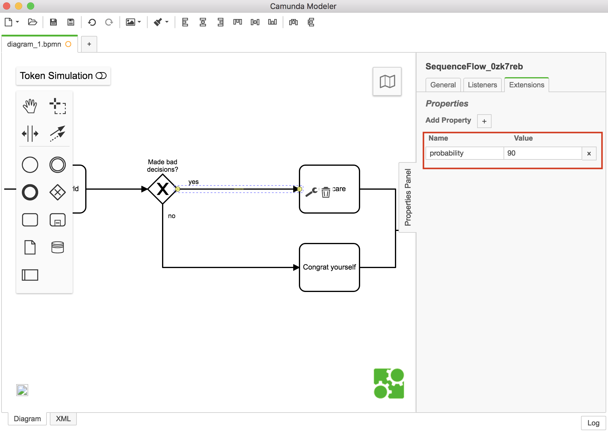
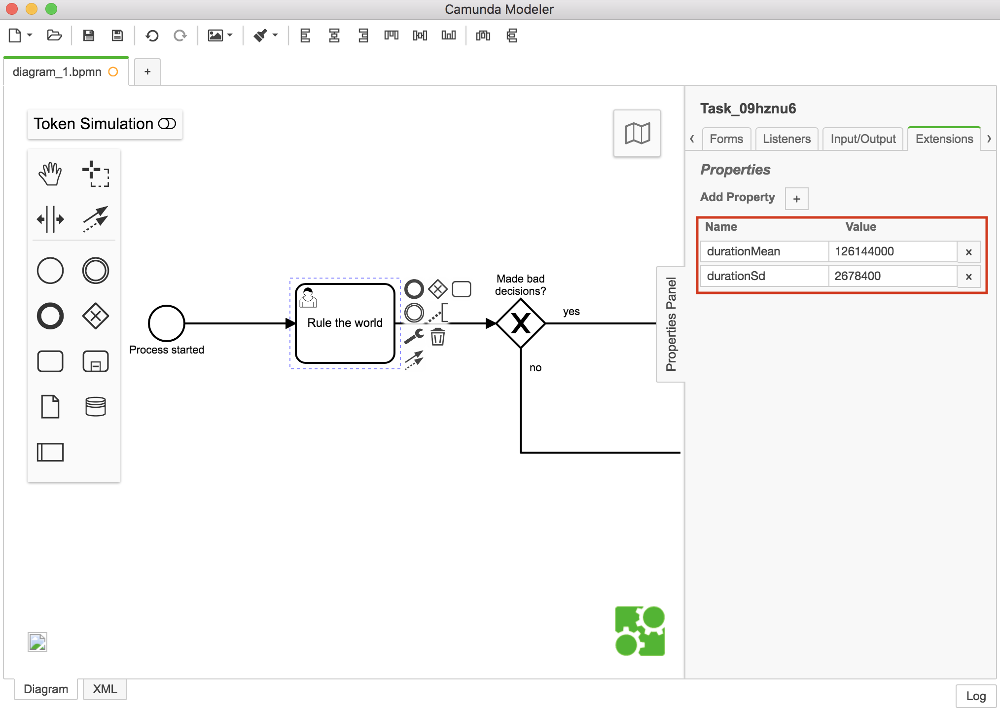
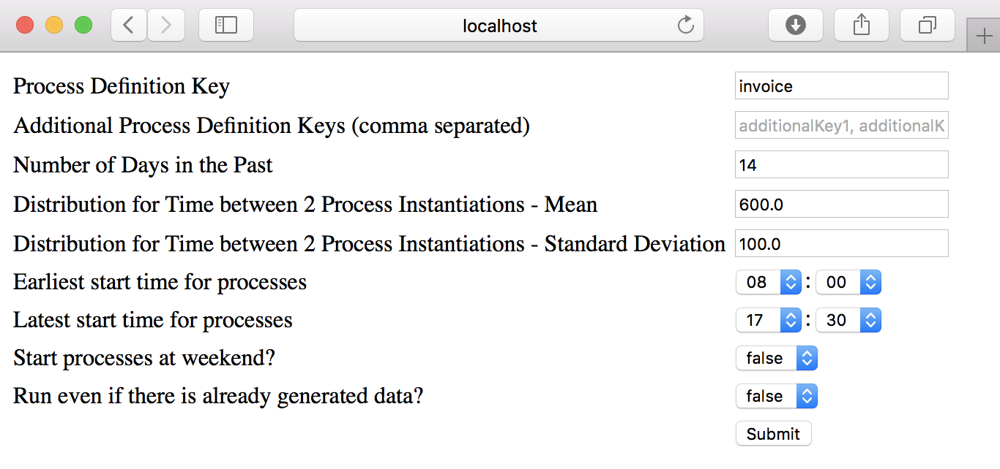

# Demo Data Generator

This project simulates BPMN process instances while skipping service tasks and other delegation code and generating data for variables.
It's goal is to fill some meaningful load in the history tables -- normally used to showcase reporting features.

Given a single process definition key, it will work without modifying your model.
Therefore, it creates a new version of your model and simulates on that model.
After that, the original model is deployed as another new version.
Hence, check the *second last process definition version* for your generated process instances!

In order to use the generator you might want to [instrument your BPMN for specifying simulation behaviour](#instrument-your-bpmn-process), [add config for creating variables during simulation](#add-content-generator) and start the Demo Data Generator via [webapplication](#start-via-webapplication) or [your own application](#start-in-your-own-application).

To learn what models that simulator can handle and what it does with the elements, see [Supported BPMN elements](#supported-bpmn-elements)

Table of Contents
=================
   * [Demo Data Generator](#demo-data-generator)
   * [How To](#how-to)
      * [Instrument your BPMN process](#instrument-your-bpmn-process)
         * [Add Probabilities to all outgoing Sequence Flows on XOR-Gateways](#add-probabilities-to-all-outgoing-sequence-flows-on-xor-gateways)
         * [Add Content Generator for Variables](#add-content-generator)
         * [Add Distribution for Duration of Wait States (Tasks, Events)](#add-distribution-for-duration-of-wait-states-tasks-events)
      * [Start the Generation](#start-the-generation)
         * [Start via Webapplication](#start-via-webapplication)
         * [Start in Your Own Application](#start-in-your-own-application)
   * [Supported BPMN elements](#supported-bpmn-elements)
      * [Working with unmodified behaviour](#working-with-unmodified-behaviour)
      * [Working with modified behaviour](#working-with-modified-behaviour)
      * [Non-Working](#non-working)
   * [Environment Restrictions](#environment-restrictions)
   * [Improvements Backlog](#improvements-backlog)
   * [License](#license)


# How To

## Instrument your BPMN process

To make this really easy there are [Element Templates](https://docs.camunda.org/manual/latest/modeler/camunda-modeler/element-templates/) provided to maintain the attributes easily in the Camunda Modeler. See:

- [Element Templates JSON for Demo Data Generator](element-templates/demo-data-generator.json)




### Add Probabilities to all outgoing Sequence Flows on XOR-Gateways:

Extension Attribute: `probability`

If you put the extension `simulateKeepImplementation=true` to the corresponding XOR-gateway, the actual condition expression of the sequence flows will be evaluated in simulation. Use with caution.




### Add Distribution for Duration of Wait States (Tasks, Events):

Set the extension attributes: `durationMean` and `durationSd`



for User Tasks, Receive Tasks,  External Tasks, Intermediate Message Events, Boundary Message Events. The values can be expressed as ISO8601 durations (for example 'P1DT2H10M') or as total number of seconds (for example '94200').

If you provide `durationMean` and `durationStd`, then a normal distribution for values with expected value `durationMean` and standard deviation `durationStd` is used for generating actual duration value. If you omit `durationStd`, then `durationMean` is used as constant value.

### Add Hints to Keep 

If you put the extension `simulateKeepImplementation=true` to the corresponding activity, the original implementation (Expression, Delegate code, ...) including scripts in execution/task listeners and input/output parameters/mappings will be used in simulation. Use with caution.


## Start the Generation

### Start via Webapplication

Deploy the camunda-demo-data-generator-webapp.war.

Once you deployed the application you can run it using
[localhost:8080/camunda-util-demo-data-generator/](localhost:8080/camunda-util-demo-data-generator-webapp/). You might have to adjust the port.

Now you can start the generation, specify:
* Process definition key to start
* Keys of additional process definitions that should be simulated, for example
    * processes called by call activities
    * processes started by throwing signals
    * ATTENTION: If a process key is not listed here, but an instance is started during simulation, it is run with original delegation code and sequence flow conditions which will most probably lead to errors
* How many days in the past you want to have instances for and if weekends shall be included
* A distribution configuring the time between two process instance starts (mean and standard deviation)
* At which time a simulation day starts and ends
* If the simulation should happen even if there are already generated instances



This will deploy a new version of the process definition which is tweaked for simulation (e.g. delegation code is removed, listeners steer the decisions, ...). After the simulation the original version is deployed again as newest version.

So you will have instances in the version before the latest version if you look into cockpit:


### Start in Your Own Application

If you set up demo systems you might want to automatically generate data during startup. E.g. you could build a system were data is cleared every night and regenerated on startup. 

Add this dependency to your project (available via Maven Central):

```
  <dependency>
    <groupId>com.camunda.consulting.util</groupId>
    <artifactId>camunda-util-demo-data-generator</artifactId>
    <version>0.5.3</version>    
  </dependency>
  
		<repository>
			<id>camunda-consulting</id>
			<url>https://app.camunda.com/nexus/content/repositories/camunda-consulting/</url>
		</repository>
```

Instrument your process definition XML for all processes where auto generation should be applied

```
  <process id="rechnungseingang" name="Rechnungseingang" isExecutable="true">
      <extensionElements>
        <camunda:properties>
          <camunda:property value="14" name="simulateNumberOfDaysInPast"/>
          <camunda:property value="1000" name="simulateTimeBetweenStartsBusinessDaysMean"/>
          <camunda:property value="2000" name="simulateTimeBetweenStartsBusinessDaysSd"/>
          <camunda:property value="09:30" name="simulateStartBusinessDayAt"/>
          <camunda:property value="17:00" name="simulateEndBusinessDayAt"/>
          <camunda:property value="true" name="simulateIncludeWeekend"/>
          <camunda:property value="true" name="simulateRunAlways"/>          
        </camunda:properties>
      </extensionElements>
```
For `simulateStartBusinessDayAt` and `simulateEndBusinessDayAt` you have to use format `hh:mm` and for `simulateIncludeWeekend` and `simulateRunAlways` every value other than `true` is interpreted as false.
`simulateTimeBetweenStartsBusinessDaysMean` and `simulateTimeBetweenStartsBusinessDaysSd` are used like `durationMean` and `durationStd` (see [Add Distribution for Duration of Wait States](#add-distribution-for-duration-of-wait-states-tasks-events)).

And add a @PostDeploy hook into your ProcessApplication class:
```
@ProcessApplication
public class InvoiceProcessApplication extends ServletProcessApplication {

  /**
   * In a @PostDeploy Hook you can interact with the process engine and access
   * the processes the application has deployed.
   */
  @PostDeploy
  public void startFirstProcess(ProcessEngine processEngine) {
    DemoDataGenerator.autoGenerateFor(processEngine, "rechnungseingang", getReference());
  }
```

That's it. You get automatically instances generated - if not more than 50 instances exist in history yet (to avoid new instances on every startup).

See [insurance application showcase](https://github.com/camunda-consulting/camunda-showcase-versicherungsneuantrag/) for an example of using it.

# Supported BPMN elements
This list is hopefully consistend and correct but certainly not complete [:)](http://citeseerx.ist.psu.edu/viewdoc/download?doi=10.1.1.13.7861&rep=rep1&type=pdf).

## Working with unmodified behaviour
* Pool/Lane
* Subprocess
* Call activity
* Event Subprocess
* Manual Task
* Parallel Gateway
* Event-based Gateway
* None Subprocess Start Events
* None Intermediate and End Events
* Intermediate Timer Events (caution if variables are used for duration/interval definition -- likely to fail)
* Link Events
* All Signal Events
* Error Events
* Escalation Events
* Termination Events
* Compensation Events
* Cancel Events

## Working with modified behaviour
* Exclusive Gateway
    * Condition of outgoing sequence flows is replaced according to [given probabilities](#instrument-your-bpmn-process)
* Service/Script/Business Rule/Send Task
    * Delegate is replaced by NOOP
* User/External/Receive Task
    * Task is completed / message correlated by simulator [duration config](#instrument-your-bpmn-process)
* Normal None Start Event for given process definition
    * instances are started by simulater according to [config](#instrument-your-bpmn-process)
* Subprocess and Intermediate Message Events
    * messages are correlated by simulator according to [duration config](#instrument-your-bpmn-process)
* End Message Events
    * Delegate is replaced by NOOP


## Non-Working
* Inclusive Gateway (outgoing sequence flows will be unmodified)
* Normal None Start Events for additional process definitions
* Message Start Event (will never be triggered)
* Timer Start Event (will never be triggered)
* Conditional Events (we have no data)
* Multi-Instance Activities (collection expression will be evaluated => switch to loop cardinality)
* Connectors (will not be skipped => switch to expression `${true}`)

# Environment Restrictions

Built and tested against Camunda BPM version 7.7.0.


# Improvements Backlog

* implements meaningfull behaviour for Non-Working BPMN elements
* move start-behaviour from process to start event -> allows multiple model to be started while simulation
* Multi-Instance loop cardinality mean and standard deviation

# License

[Apache License, Version 2.0](http://www.apache.org/licenses/LICENSE-2.0).